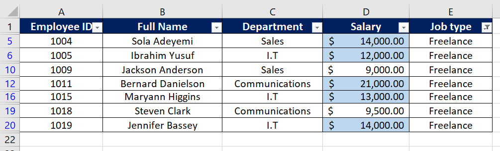
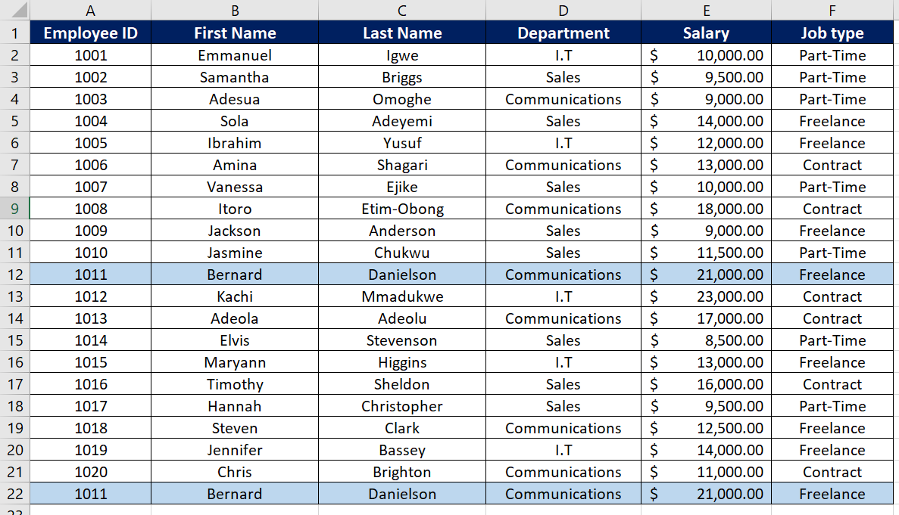
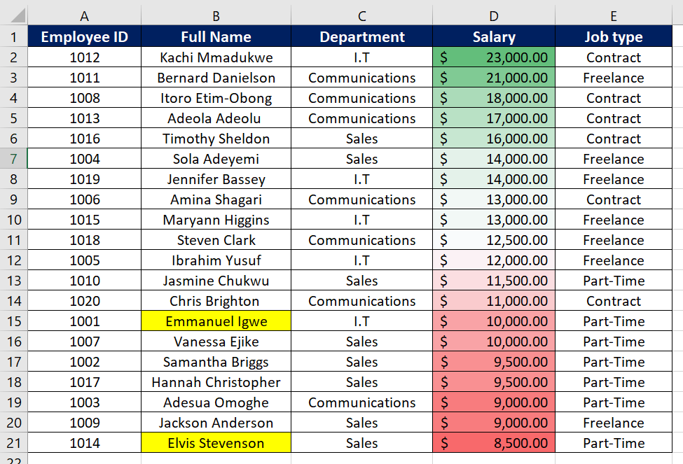

# Company AB Employee Database

## Introduction

This is a Microsoft Excel project on the employee database of a fictional marketing organization called **Company AB**. The project is to analyze and derive insights to answer crucial questions and help the store make data-driven decisions.

**_Disclaimer_**⚠️: _All datasets and reports do not represent any real company, organization or institution, but just a dummy dataset to demonstrate my strengths and capacity with Microsoft Excel._

## Tasks

- **Employees who are freelancers earning salary above $10,0000 are highlighted** 💰.

- **Employees full names are splited into first name and last name and duplicates are checked for.**

- **Highlights employees with "E" as initials and also highlights the highest earners in Green and the lowest earners in Red.**

# Conclusion and Recommendation

Conclusion and recommendation of the above analysis can be carried out ideally if there is a problem statement. The availabilty of problem statements gives the freedom to make suggestion, opinions, and inference based on the result of the analysis.

